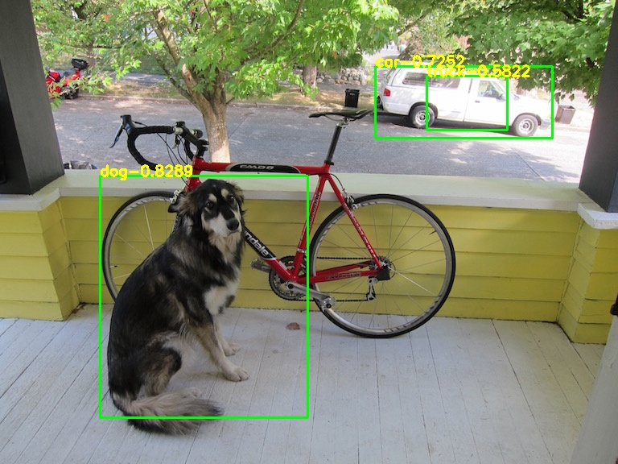
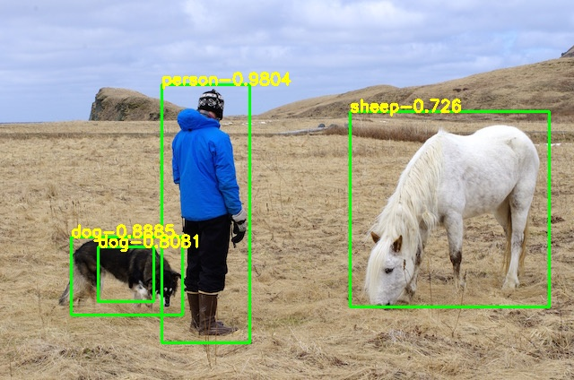
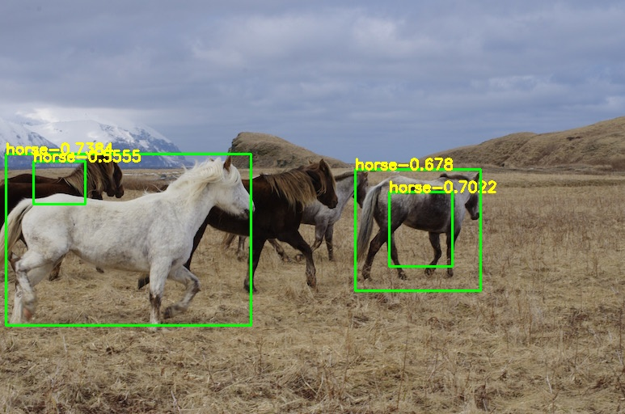
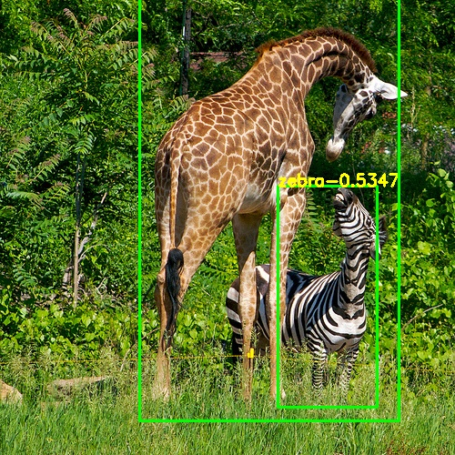

# YOLOV3_PyTorch
yolov3 to pytorch

## Demo
     
   

## 中文解读
传送门

## Model
[yolov3-tiny.weights](https://pjreddie.com/media/files/yolov3-tiny.weights)

## Reference
https://pjreddie.com/darknet  
https://github.com/AlexeyAB/darknet  
https://blog.csdn.net/samylee  
